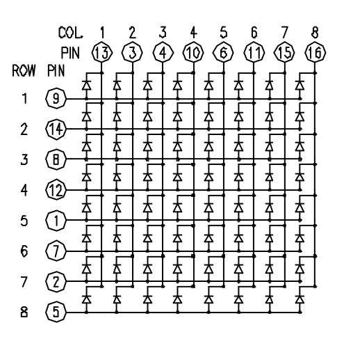

# LED Matrix Clock

A scrolling clock on an 8×8 LED matrix driven by an Arduino Nano and a DS3231 RTC module.



## Hardware

| Component         | Notes                                  |
| ----------------- | -------------------------------------- |
| Arduino Nano v3.0 | Set board to **Nano** in Arduino IDE   |
| 8×8 LED matrix    | Common-cathode, single module          |
| DS3231 RTC        | Connected via I2C (A4 = SDA, A5 = SCL) |

## Wiring

```
Arduino Nano → LED Matrix pin
A0  → pin 13 (row 8)     A1  → pin  3 (row 7)
A2  → pin  4 (row 6)     A3  → pin 10 (row 5)
 2  → pin  2 (col 2)      3  → pin  7 (col 3)
 4  → pin  1 (col 4)      5  → pin 12 (col 5)
 6  → pin  8 (col 6)      7  → pin 14 (col 7)
 8  → pin  9 (col 8)      9  → pin 15 (row 2)
10  → pin 16 (row 1)     11  → pin  6 (row 4)
12  → pin 11 (row 3)     13  → pin  5 (col 1)
```

## Libraries

- [Time](https://github.com/PaulStoffregen/Time) - use the older version (see note below)
- [RTClib](https://github.com/adafruit/RTClib)

> **Note:** Arduino IDE 2.1.0.5 produces a much brighter display than newer versions.
> Newer AVR cores added overhead to `digitalWrite`, reducing the duty cycle of the multiplexed matrix and dimming the display.
> A symlink to the older Time library may be required - see the RTClib DS3231 examples for reference.

## Setup

### 1. Set the RTC time

Open `set_clock_ds3231/set_clock_ds3231.ino` in the Arduino IDE and upload it. The sketch captures the local time at compile time (`__DATE__` / `__TIME__`), then asks for your UTC offset via the Serial Monitor.

> **Note:** Type the UTC offset promptly after clicking **Upload**. The RTC will be off by however long the upload and boot take (typically 30–60 seconds). For a clock showing HH:MM this is acceptable.

### 2. Upload the clock sketch

Open `led_matrix_clock.ino` in the Arduino IDE and upload to the Nano.

DST (European summer/winter time) is applied automatically at startup. The RTC stores UTC; the timezone offset entered during step 1 is saved to EEPROM and read by the clock sketch on every boot.

### 3. Debug mode

Set `#define DEBUG 1` in `led_matrix_clock.ino` to enable serial output of the time read from the RTC.
